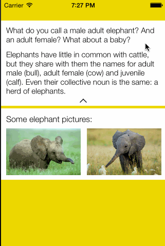
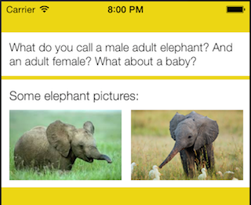

ACExpandableDescription
================

ACExpandableDescription is custom iOS control that provides an adaptable view to show a title and a description if provided. The description text is hiden and only shown if the user taps anywhere inside the `ACExpandableDescription`.

Provide the `ACExpandableDescription` with:

  - A Title
  - A Title and a Description
  - Nothing


Installation and usage
----------------------
1. Copy `ACExpandableDescription.h` and `ACExpandableDescription.m` to your Xcode project.
2. Create a new instance of `ACExpandableDescription` with a frame of your choice and add it to the view hierarchy. Or use interface builder to create the view and change the class of that view to `ACExpandableDescription`.
3. Set the title and description to the `ACExpandableDescription` object.
4. Rearrange the views below the `ACExpandableDescription`. The method `getOriginalSize` will return the `CGFrame` of the `ACExpandableDescription` in the original size so you can relocate the view below it. 
5. Add `Touch Up Inside` event that is going to be called when the `ACExpandableDescription` is tapped. 
6. Inside the `Touch Up Inside` call rearrange the frame of the views below the `ACExpandableDescription`. There is a method `heightDifference` that will return a `float` with the distance to move up or down the views.

If you want to change the font to the title or to the description the following methods have to be called with the following `NSDictionary` as an argument:

```
@{NSFontAttributeName:[UIFont fontWithName:@"HelveticaNeue-Light" size:15]};
```

```
- (void) setTitleAttributes:(NSDictionary *) attributes
- (void) setDescriptionAttributes:(NSDictionary *) attributes
```


Examples
--------
If you have __title and description__ provided you just have to set the title and the description to the `ACExpandableDescription`. After that you have to rearrange the view below it and set it's frame:

```objective-c
[_expandableView setTitle:@"What do you call a male adult elephant? And an adult female? What about a baby?"];
[_expandableView setDescription:@"Elephants have little in common with cattle, but they share with them the names for adult male (bull), adult female (cow) and juvenile (calf). Even their collective noun is the same: a herd of elephants."];

CGRect frame = [_expandableView getOriginalSize];
[_otherContent setFrame:CGRectMake(_otherContent.frame.origin.x,
                                   frame.origin.y + frame.size.height,
                                   _otherContent.frame.size.width,
                                   _otherContent.frame.size.height)];

```

```objective-c
- (IBAction)expandStarted:(id)sender {
    [UIView animateWithDuration:_expandableView.animationTime animations:^{
        [_otherContent setFrame:CGRectMake(_otherContent.frame.origin.x, _otherContent.frame.origin.y + [_expandableView heightDifference], _otherContent.frame.size.width, _otherContent.frame.size.height)];
    }];
}
```
The result will be: 




If you have just the __title__, set the title (and if you want the empty the description) to the `ACExpandableDescription`. After that you have to rearrange the views below it:

```objective-c
[_expandableView setTitle:@"What do you call a male adult elephant? And an adult female? What about a baby?"];

CGRect frame = [_expandableView getOriginalSize];
[_otherContent setFrame:CGRectMake(_otherContent.frame.origin.x,
                                   frame.origin.y + frame.size.height,
                                   _otherContent.frame.size.width,
                                   _otherContent.frame.size.height)];

```

```objective-c
- (IBAction)expandStarted:(id)sender {
    [UIView animateWithDuration:_expandableView.animationTime animations:^{
        [_otherContent setFrame:CGRectMake(_otherContent.frame.origin.x, _otherContent.frame.origin.y + [_expandableView heightDifference], _otherContent.frame.size.width, _otherContent.frame.size.height)];
    }];
}
```

The result will be: 




If you have __nothing__ provided `ACExpandableDescription` will return an empty view. Rearrange the views below it:

```objective-c
[_expandableView setTitle:@""];

CGRect frame = [_expandableView getOriginalSize];
[_otherContent setFrame:CGRectMake(_otherContent.frame.origin.x,
                                   frame.origin.y + frame.size.height,
                                   _otherContent.frame.size.width,
                                   _otherContent.frame.size.height)];

```

```objective-c
- (IBAction)expandStarted:(id)sender {
    [UIView animateWithDuration:_expandableView.animationTime animations:^{
        [_otherContent setFrame:CGRectMake(_otherContent.frame.origin.x, _otherContent.frame.origin.y + [_expandableView heightDifference], _otherContent.frame.size.width, _otherContent.frame.size.height)];
    }];
}
```

The result will be: 


Version
----
1.0

License
----
MIT


**Free Software, Hell Yeah!**
